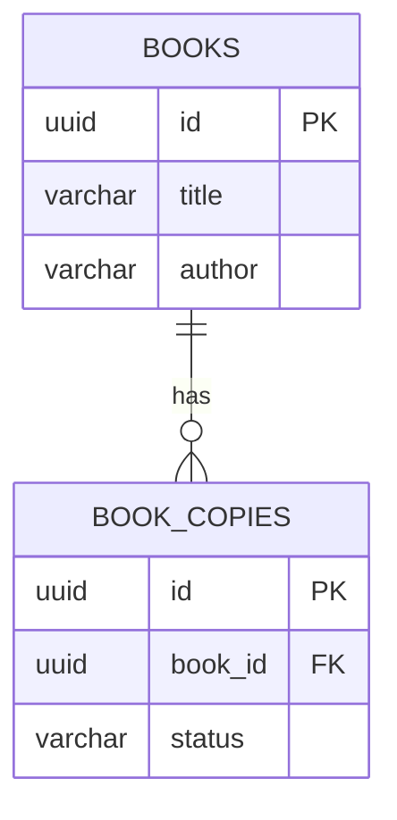

# データベース設計スキル

テーブル定義書・ER図（Mermaid）・既存DDLを入力として受け取り、正規化分析・インデックス設計・PostgreSQL マイグレーションSQLを生成する。

## 対象環境

- **データベース**: PostgreSQL
- **マイグレーション形式**: このプロジェクトの `createMigration()` パターン（`src/infrastructure/database/schema.ts`）

## 入力形式

以下のいずれかを受け付ける。複数形式の混在も可。

| 形式 | 説明 |
|------|------|
| Markdown テーブル定義書 | テーブル名・カラム名・型・制約の一覧表 |
| Mermaid ER図 | `erDiagram` 記法によるエンティティ関連図 |
| 既存 SQL (CREATE TABLE) | 分析・改善対象の既存DDL |

## 手順

### Step 1: 入力の解析と現状把握

1. 入力形式を特定する（Markdown定義書 / Mermaid ER図 / 既存DDL）
2. エンティティ（テーブル）と属性（カラム）を抽出する
3. リレーション（外部キー関係）を特定する
4. 既存の制約・インデックスがあれば洗い出す

**出力**: エンティティ一覧表（テーブル名・カラム・型・制約・リレーション）

### Step 2: 正規化分析

[正規化チェックリスト](./references/normalization-checklist.md) に従い分析する。

1. **第1正規形 (1NF)**: 繰り返しグループ・複合値がないか
2. **第2正規形 (2NF)**: 部分関数従属がないか（複合主キーの場合）
3. **第3正規形 (3NF)**: 推移的関数従属がないか
4. **BCNF**: すべての決定項が候補キーか

**出力**:
- 正規化レベルの判定（各テーブルごと）
- 違反箇所の指摘と改善案（テーブル分割案など）
- 意図的な非正規化がある場合はその理由とトレードオフを明記

### Step 3: インデックス設計

[インデックス設計ガイド](./references/index-design-guide.md) に従い設計する。

1. **主キー**: UUID + `gen_random_uuid()` を標準とする（プロジェクト規約）
2. **外部キー**: 参照元カラムには必ずインデックスを付与
3. **検索パターン分析**: ユーザーに想定クエリを自然言語で確認し（例:「著者名で検索」「カテゴリ別に一覧」）、そこからインデックスを導出
4. **複合インデックス**: カーディナリティの高い順にカラムを配置
5. **全文検索**: `tsvector` + GIN インデックスの検討（テキスト検索が必要な場合）
6. **部分インデックス**: 特定条件のクエリが頻出する場合に `WHERE` 付きインデックスを検討

**出力**:
- インデックス一覧（名前・対象カラム・種別・理由）
- 不要インデックスの警告（重複・低選択性など）

### Step 4: マイグレーションSQL生成

このプロジェクトのマイグレーションパターンに従い生成する。

#### 命名規則
- `NNN_動詞_対象テーブル_概要` 形式（例: `009_create_notifications_table`）
- 連番は既存マイグレーション（`src/infrastructure/database/schema.ts`）の最大番号の次から開始

#### 必須要素
- `up` SQL: 冪等性のため `IF NOT EXISTS` / `IF EXISTS` を使用
- `down` SQL: ロールバック用の逆操作
- `timestamp`: `Date.now()` で自動生成

#### PostgreSQL 規約
- 主キー: `id UUID PRIMARY KEY DEFAULT gen_random_uuid()`
- タイムスタンプ: `TIMESTAMP WITH TIME ZONE NOT NULL DEFAULT NOW()`
- ステータス列: `CHECK` 制約で列挙値を制限
- 外部キー: `ON DELETE CASCADE` / `ON DELETE SET NULL` を明示
- インデックス名: `idx_テーブル名_カラム名`

#### 出力形式

`src/infrastructure/database/schema.ts` に追加する TypeScript 関数として生成:

```typescript
export function createXxxTableMigration(): Migration {
  return createMigration({
    name: 'NNN_create_xxx_table',
    up: `
CREATE TABLE IF NOT EXISTS xxx (
  id UUID PRIMARY KEY DEFAULT gen_random_uuid(),
  -- カラム定義
  created_at TIMESTAMP WITH TIME ZONE NOT NULL DEFAULT NOW(),
  updated_at TIMESTAMP WITH TIME ZONE NOT NULL DEFAULT NOW()
);

CREATE INDEX IF NOT EXISTS idx_xxx_yyy ON xxx(yyy);
`,
    down: 'DROP TABLE IF EXISTS xxx;',
  });
}
```

### Step 5: ER図の生成

分析結果を Mermaid `erDiagram` 形式で可視化する。

- 全テーブルとリレーションを含める
- カーディナリティ（`||--o{` 等）を正確に記述
- 主キー（PK）・外部キー（FK）を明示
- 新規追加テーブルと既存テーブルの区別がつくようコメントを付与



### Step 6: レビューと最終確認

1. 既存テーブルとの整合性を確認（外部キー参照先の存在）
2. マイグレーションの実行順序が依存関係を満たすか検証
3. `getAllMigrations()` への登録を忘れないよう案内
4. 変更が既存データに影響する場合はデータ移行手順も提示

## 注意事項

- **破壊的変更**（カラム削除・型変更）は必ずユーザーに確認してから生成する
- **本番データ**がある場合、`ALTER TABLE` では `DEFAULT` 値やデータ移行を考慮する
- 生成したSQLは必ず `npm run db:init` で適用可能な形式にする
